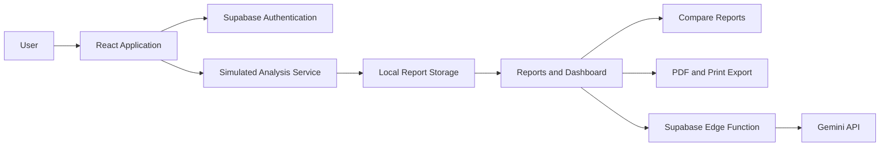

# MoveSafe AI

MoveSafe AI is an educational movement-analysis web application that
demonstrates how users can upload a movement file, receive a simulated
movement report, compare results, review educational content, and explore
report trends.

> **Important:** All analysis results are **simulated**. MoveSafe AI is a
> student demonstration project for educational purposes only. It is **not a
> medical tool**, it does **not diagnose injuries**, and it does **not
> replace evaluation by a qualified healthcare professional**.

## Project Overview

The application walks a user through a complete movement-learning workflow:

1. Create an account or sign in (guests can also try the Analyze page)
2. Upload a supported movement video
3. Choose a movement type (squat, jump, landing, running, walking, or custom)
4. Generate a simulated educational report
5. Review the overall score, per-metric scores, observations, and recommendations
6. Save reports locally in the browser
7. Compare two compatible reports side by side
8. Review patterns on the Dashboard (summary cards, charts, and feedback)
9. Optionally request Gemini-enhanced educational feedback
10. Explore injury-prevention and movement-learning resources on the Learn page

## Educational Purpose

This project demonstrates, in one application:

- React application architecture with a clear pages/components/services split
- Authentication and protected routes
- File input handling with validation and previews
- Local data persistence behind a service layer
- Deterministic report generation
- Hand-rolled data visualization (CSS and SVG charts)
- Report comparison logic
- PDF export and browser print workflows
- AI service integration behind a serverless function
- Server-side secret management
- Responsive design
- Accessibility-focused implementation

It does **not** perform real biomechanical measurement — see
[Simulated Analysis](#simulated-analysis).

## Technology Stack

**Frontend**

- React 19
- TypeScript
- Vite
- React Router (react-router-dom 7)
- Regular CSS (no CSS frameworks)

**Authentication and Serverless**

- Supabase Authentication (`@supabase/supabase-js`)
- Supabase Edge Functions (Deno runtime)

**AI**

- Google Gemini API (called only from the Edge Function)

**Data and Storage**

- Browser localStorage for report persistence (versioned, behind a service)

**Export**

- `jspdf` + `html2canvas` for PDF generation
- Native browser print with dedicated print styles

## Main Features

**Public Experience**

- Home page with feature navigation
- Learn page (movement basics, prevention tips, injury library, posture
  gallery, nutrition, warm-ups, video resources)
- Privacy, Terms of Use, and Disclaimer pages
- Login and signup (with `/signin` and `/sign-up` aliases)
- Forgot-password and reset-password flow

**Movement Analysis**

- Video selection with drag-and-drop and preview
  (mp4/webm/mov up to 50 MB — video only, images are not accepted)
- Movement-type selection with custom movement support
- Simulated analysis processing state
- Educational overall score and per-metric scores
- Optional personal notes, shown as a Notes section in the report, PDF, and print output
- Report creation for both guests and signed-in users

**Report Management**

- Local report storage (versioned localStorage behind a service)
- User-specific report history
- Search, movement/status filters, and six sort options
- Report deletion with an accessible confirmation dialog
- Report detail view with score circle, metrics, observations, and recommendations
- PDF download and browser printing

**Comparison**

- Selection of exactly two compatible completed reports
- Overall score comparison
- Metric-by-metric differences (±1 counts as unchanged)
- Visual comparison charts with text equivalents
- Educational interpretation summary

**Dashboard**

- Summary cards (total reports, average score, most analyzed movement, latest report)
- Recent reports and quick actions
- Movement distribution and score history charts with a time-range filter
- Local deterministic educational feedback
- Suggested next steps

**Optional AI Feedback**

- User-triggered Gemini feedback (never automatic)
- Limited report-summary context (no files, IDs, or account data)
- Supabase Edge Function with authentication required
- Server-side API-key storage (Supabase secret)
- Structured, validated response with an unsafe-language check
- Educational disclaimer always included

## Screenshots

### Home Page

Add screenshot here.

### Analyze Page

Add screenshot here.

### Report Detail

Add screenshot here.

### Compare Reports

Add screenshot here.

### Dashboard

Add screenshot here.

## Prerequisites

- Node.js — use a current Node.js LTS release
- npm
- A Supabase account and project (authentication enabled)
- Supabase CLI for Edge Function development and deployment
  (used via `npx supabase`, no global install required)
- A Gemini API key for the optional AI feedback feature
- Docker Desktop (only if you want to run the Supabase stack locally)

## Installation

```bash
git clone YOUR_REPOSITORY_URL
cd YOUR_PROJECT_FOLDER
npm install
```

## Frontend Environment Variables

Copy the example file and fill in your own Supabase values:

```bash
cp .env.example .env
```

On Windows PowerShell:

```bash
Copy-Item .env.example .env
```

The frontend needs exactly two variables:

```
VITE_SUPABASE_URL=YOUR_SUPABASE_PROJECT_URL
VITE_SUPABASE_ANON_KEY=YOUR_SUPABASE_PUBLISHABLE_KEY
```

The publishable (anon) key is safe to use in the frontend. **Never** put the
Gemini key in the frontend configuration — there is no `VITE_GEMINI_API_KEY`
in this project by design, and none should be added.

Also configure your Supabase project's redirect-URL allowlist to include
`http://localhost:5173/reset-password` so the password-reset flow works in
development.

## Gemini Edge Function Setup

The Gemini API key is stored as a **Supabase server-side secret** and never
reaches the browser. To deploy the function:

```bash
npx supabase login
```

```bash
npx supabase link --project-ref YOUR_PROJECT_REF
```

```bash
npx supabase secrets set GEMINI_API_KEY=YOUR_GEMINI_API_KEY
```

```bash
npx supabase functions deploy generate-ai-feedback
```

Deploy **without** `--no-verify-jwt` — the function must reject
unauthenticated requests.

### Local Edge Function Development

For local serving (requires Docker Desktop), create `supabase/functions/.env`
(this file is gitignored — never commit it):

```
GEMINI_API_KEY=YOUR_GEMINI_API_KEY
```

Then run:

```bash
npx supabase start
```

```bash
npx supabase functions serve generate-ai-feedback --env-file supabase/functions/.env
```

## Running the Application

Development server (http://localhost:5173):

```bash
npm run dev
```

Production build (type-checks first):

```bash
npm run build
```

Preview the production build:

```bash
npm run preview
```

Lint:

```bash
npm run lint
```

Type-check only:

```bash
npx tsc -b
```

## Project Structure

```
src/
  assets/       Images and illustrations
  components/   Reusable presentational and interactive components
  constants/    Shared text constants (educational disclaimers)
  context/      AuthContext provider + context object
  data/         Sample reports (manual dev seeding only)
  hooks/        useAuth, useDocumentTitle
  layouts/      MainLayout (header, main, footer, skip link)
  pages/        Route-level screens
  services/     Business logic and integrations
  styles/       Global tokens + one CSS file per page/feature
  types/        Shared TypeScript models
  utils/        Pure helpers (validation, formatting, filtering)

supabase/
  config.toml
  functions/
    generate-ai-feedback/   Deno Edge Function (index.ts + validation.ts)

public/
```

## Application Architecture

- **Pages** — route-level screens such as Home, Analyze, Reports, Compare,
  and Dashboard. Pages stay thin: they render state and call services.
- **Components** — reusable visual and interactive elements (cards, charts,
  dialogs, page states, the error boundary).
- **Services** — all business logic and side effects: report storage,
  analysis simulation, comparison, Dashboard summaries and feedback, PDF
  export, the Supabase client, and Gemini invocation.
- **Types** — shared TypeScript models for reports, comparisons, dashboards,
  and AI feedback.
- **Hooks and Context** — authentication state (`AuthContext` + `useAuth`),
  document titles, and route focus behavior.
- **Styles** — design tokens in `global.css` plus page-specific stylesheets.
- **Supabase Edge Function** — authenticated server-side request validation
  and Gemini communication; the only place the Gemini key exists.

## System Flow

Main flow:

```
User → React interface → Supabase authentication → Analyze form
     → Simulated analysis service → Movement report → Local report storage
     → Reports, Compare, and Dashboard
```

Optional AI feedback:

```
Authenticated user → Dashboard → Limited report summary
     → Supabase Edge Function → Gemini API
     → Validated educational feedback → Dashboard
```

**Uploaded movement files are never sent to Gemini** — only a limited
summary of simulated scores and metric names.



> The Gemini flow sends only a limited report summary, not uploaded movement
> files or account details. Local report storage is browser localStorage —
> convenient for a demonstration, not a secure medical database.

## Data Storage

- Reports are stored in browser localStorage in a versioned format
  (`{ version: 1, reports: [...] }`), accessed only through
  `src/services/reportStorage.ts`.
- Reports are separated by authenticated user ownership in the application
  logic; guest reports have no owner and are viewable only in that browser.
- Data is specific to the current browser and device; clearing browser data
  removes reports, and reports do not synchronize across devices.
- Uploaded files are never permanently stored — only name, type, and size
  metadata. Temporary preview URLs are revoked when no longer needed.
- localStorage is **not** production-grade secure storage; a real deployment
  would move reports to a server-side database with row-level security.

## Authentication

- Supabase handles account authentication (email + password).
- Protected routes (`/dashboard`, `/reports`, `/compare`) wait until the
  session is resolved, so private content never flashes.
- Signed-out users are redirected to login; after signing in they return to
  the page they originally requested (only safe internal paths are allowed).
- User passwords are handled entirely by Supabase — the React application
  never stores them.

## Simulated Analysis

The current analysis engine:

- Does **not** inspect real body landmarks
- Does **not** use MediaPipe or computer vision
- Generates deterministic educational demonstration scores (the same upload
  details always produce the same simulated result)
- Exists to model the full application workflow before real movement
  analysis is added

Future versions could replace the simulated service with a real
pose-analysis backend; the report structure is already shaped for that.
That feature does **not** exist today.

## Report Comparison

- Standard movement reports can be compared when their movement types match.
- Custom movement reports match when their names are equal after
  normalization (trim, lowercase, collapsed spaces).
- Exactly two completed reports are compared; they remain independent.
- Differences are educational score changes: positive changes do not prove
  physical improvement, and negative changes do not prove physical decline.

## Local Educational Feedback

Deterministic TypeScript logic (no AI involved) calculates:

- The latest report's educational category
- The recent score pattern (increasing, decreasing, or stable)
- The strongest recurring metric
- The recurring metric most in need of attention
- Suggested next actions (up to four)

This feature always works, even when Gemini is unavailable — it is the
default and the fallback.

## Optional AI-Enhanced Feedback

- Gemini runs **only** after the user clicks the generation button.
- The application builds a limited report summary (at most 5 recent reports,
  at most 5 metrics each).
- The Supabase Edge Function verifies the user's authentication, validates
  and sanitizes the input, and calls Gemini with the server-side secret.
- Gemini returns structured educational feedback, which is validated (shape,
  length, unsafe-language check) before display.
- If Gemini fails for any reason, the local feedback remains available.

Gemini never receives: uploaded files, report IDs, email addresses, user
IDs, Supabase tokens, or the full report history.

## Privacy and Security Notes

- No medical claims anywhere in the application.
- No permanent movement-file storage.
- No client-side Gemini secret — the key exists only as a Supabase secret
  (or in the gitignored local function `.env`).
- The Edge Function requires authentication and never forwards account data
  to Gemini.
- AI context is limited and AI responses are validated before display.
- No raw tokens, credentials, user IDs, or full report IDs are displayed or
  logged.
- Environment files are excluded from Git (see `.gitignore`).
- Client-side localStorage has real limitations; a production system would
  require server-side storage, row-level security, and a security review.
- No formal compliance (such as HIPAA) is claimed.

## Accessibility

Completed accessibility work includes:

- Semantic headings (one `<h1>` per page) and a single `<main>` landmark
- A skip link to main content, visible on keyboard focus
- Focus moved to main content after route changes
- Keyboard-accessible navigation, including the mobile menu
  (Escape closes it and returns focus)
- Visible focus indicators everywhere
- Form labels, `aria-invalid`, linked error messages, and focus moved to the
  first invalid field
- Loading states announced with `role="status"`, errors with `role="alert"`
- Text summaries and keyboard-selectable points for charts
- Reduced-motion support
- Status meaning conveyed with text, never color alone

The project includes accessibility-focused implementation and should still
be reviewed with automated and manual accessibility testing before
production use.

## Responsive Design

Designed for desktop, tablet, mobile, and 200% browser zoom, with
responsive cards, stacked mobile layouts, an accessible mobile navigation
menu, flexible charts, wrapping action controls, and responsive images.
Verified at several representative widths (360–1440 px), though not on
every physical device model.

## Error Handling

- A global React error boundary shows a safe fallback (with Reload and
  Go Home) for unexpected rendering errors — never stack traces.
- Route-level loading, empty, and error states handle expected situations.
- Invalid or corrupted localStorage data is skipped safely; one bad entry
  never deletes the rest.
- Missing or inaccessible reports show a helpful state with next actions.
- Invalid compare selections are each explained.
- Gemini failures map to friendly messages (timeout, rate limit, service
  unavailable), requests can be cancelled, and the local feedback always
  remains.

## Manual Testing

Key scenarios (see the full checklist below):

- **Authentication:** signup, login, logout, forgot password, protected-route redirect
- **Analysis:** valid file, invalid file, file replacement, processing state, retry after error
- **Reports:** empty state, multiple reports, search, filter, delete, missing report
- **Compare:** compatible reports, incompatible reports, missing selections
- **Dashboard:** no reports, one report, multiple reports, chart filters,
  local feedback, Gemini success and failure
- **Accessibility:** keyboard navigation, skip link, focus states, 200% zoom, reduced motion

For the complete release checklist, see [FINAL_TESTING.md](FINAL_TESTING.md).

## Current Limitations

- Analysis is simulated; uploaded files are not actually analyzed.
- Reports are stored only in localStorage and do not synchronize across devices.
- Gemini feedback requires a configured and deployed Edge Function.
- AI feedback may occasionally be unavailable (rate limits, timeouts).
- No healthcare or clinical validation of any content or score.
- No production-grade database for reports.
- No administrator features.
- No real-time pose tracking.

## Possible Future Improvements

These are future possibilities, **not** current features:

- MediaPipe or pose-estimation integration with real landmark processing
- Secure server-side report database with row-level security
- Cross-device report synchronization
- Video-frame analysis
- User profile settings and goal tracking
- Deeper accessibility audits
- Automated unit and integration tests
- Rate limiting for AI requests
- Server-side report ownership enforcement
- Research-backed movement scoring

## Disclaimer

MoveSafe AI provides simulated educational movement feedback. It is not a
medical diagnosis, injury assessment, or substitute for evaluation by a
qualified healthcare professional.

Users experiencing pain, injury symptoms, or health concerns should consult
a qualified healthcare professional.

## Development Notes

- Use TypeScript types for all shared data.
- Keep business logic in services; keep pages and components presentational.
- Never access localStorage directly from pages — go through
  `src/services/reportStorage.ts`.
- Keep private keys out of frontend code and out of any `VITE_` variable.
- Preserve the educational (never medical) wording.
- Test responsive and keyboard behavior after UI changes.
- Run `npm run build` (which type-checks) and `npm run lint` before
  submitting changes.

## Documentation

- [SECURITY.md](SECURITY.md) — security audit findings, proposed RLS policies, production checklist
- [FINAL_TESTING.md](FINAL_TESTING.md) — release testing checklist
- [TECHNICAL_OVERVIEW.md](TECHNICAL_OVERVIEW.md) — architecture deep-dive for reviewers
- [STUDENT_PRESENTATION_OUTLINE.md](STUDENT_PRESENTATION_OUTLINE.md) — 7–10 minute presentation outline
- [DEMO_SCRIPT.md](DEMO_SCRIPT.md) — 4–5 minute spoken demo script
- [PROJECT_SUBMISSION_CHECKLIST.md](PROJECT_SUBMISSION_CHECKLIST.md) — final submission checklist

## License

This student project is currently provided for educational and portfolio
use. Add a formal license before public distribution or reuse.
